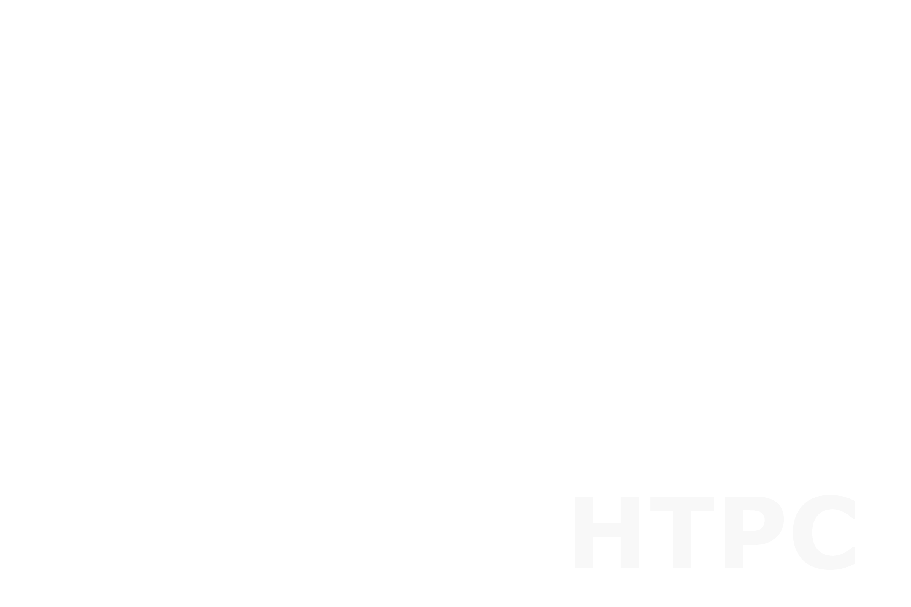
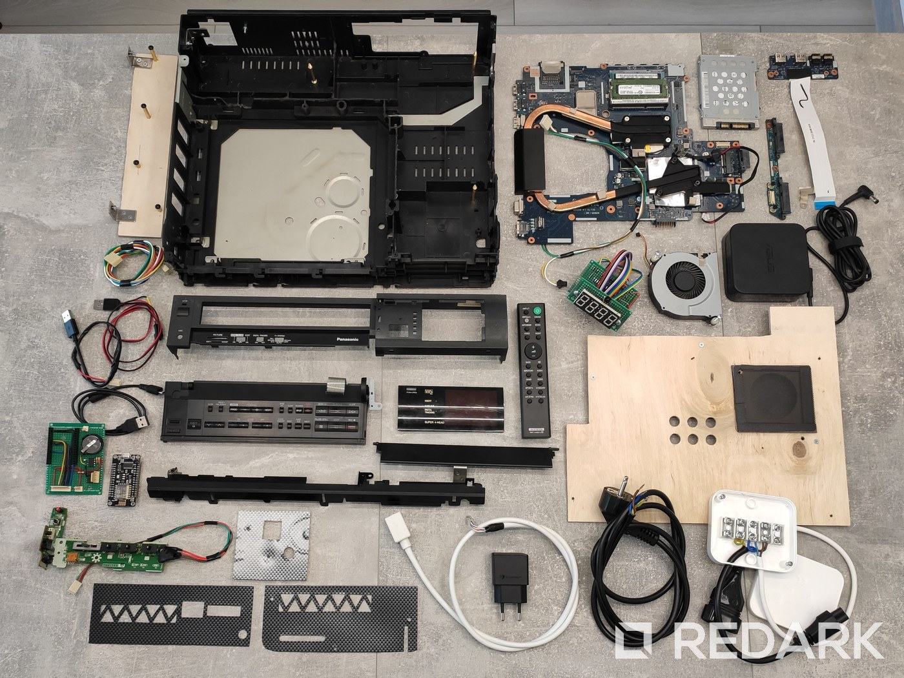
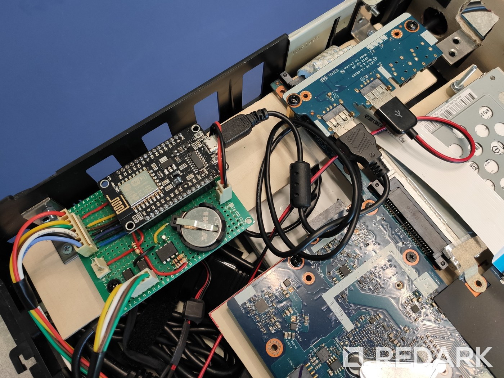
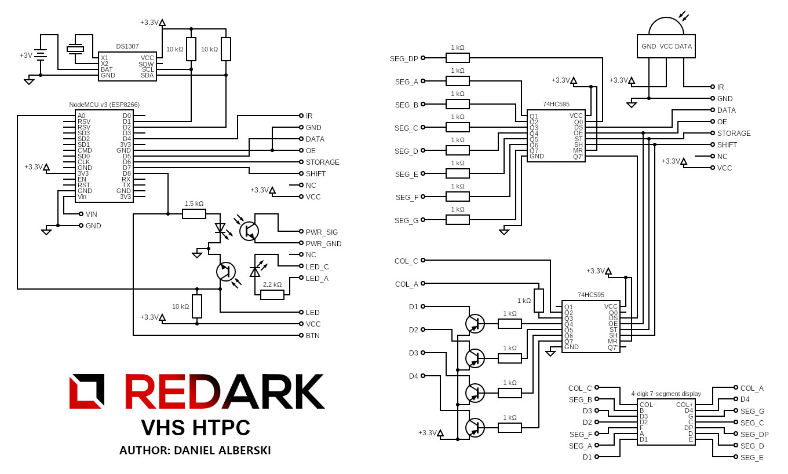

# VHS HTPC Project

This repository contains the source code of my DIY project called VHS HTPC. The device has been made from an old VHS player (Panasonic NV-J35HQ) and an old laptop (ASUS K75VJ). The device is controlled by a remote control from Sony's soundbar. The remote allows you to turn on/off the device and control the operating system. The device is also equipped with a 7-segment LCD screen that displays the current time, status of the PC and the current temperature of CPU.

## Features

1. IR remote control
2. 7-segment 4-digit LCD screen
3. Real-time clock and CPU temperature monitoring
4. 3 different modes of LCD operation
5. Easily accessible keyboard shortcuts
6. Predefined apps and websites shortcuts
7. OS integration (e.g. volume control, switching between apps, clipboard etc.)

## Article

The article about this project is available on my blog. Currently only available in Polish:

[REDARKpl blog](https://redark.pl/vhs-htpc-project)

## Video

The video presentation of this project is available on YouTube with Polish and English subtitles:

[YouTube video](https://www.youtube.com/watch?v=vgGN3KrSJ-c)

## Gallery

